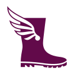

# Wader

## Name
> Waders denotes a waterproof boot or overalls extending from the foot to the thigh, the chest or even the neck.

This name has been chosen because waders are waterproof boots. 
Wader is way to get Bootstrap components into C#, using Blazor, in a safe and tested way.

## Attributions

- Boot by Fabio Meroni from <a href="https://thenounproject.com/browse/icons/term/boot/" target="_blank" title="Boot Icons">Noun Project</a> (CC BY 3.0)